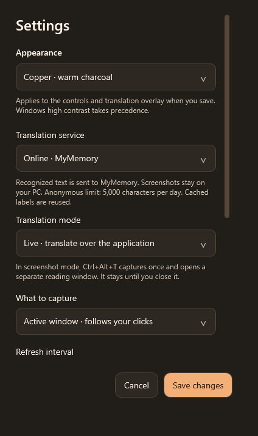
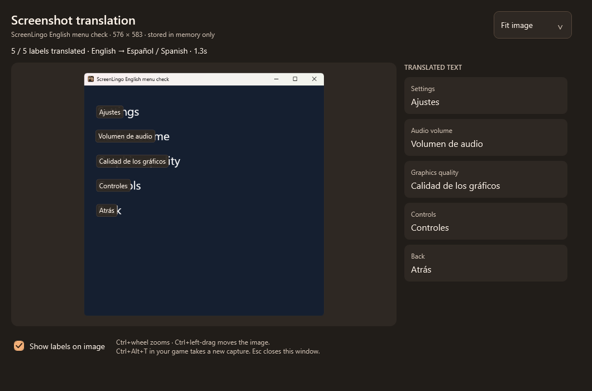
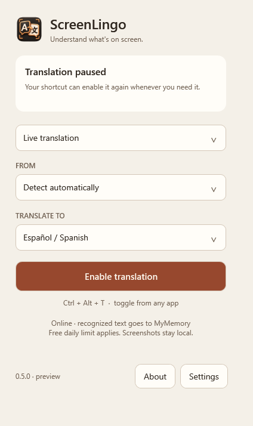
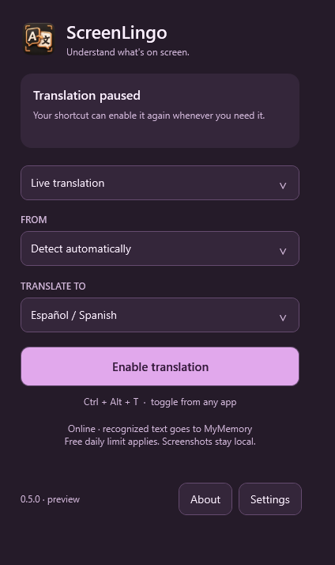
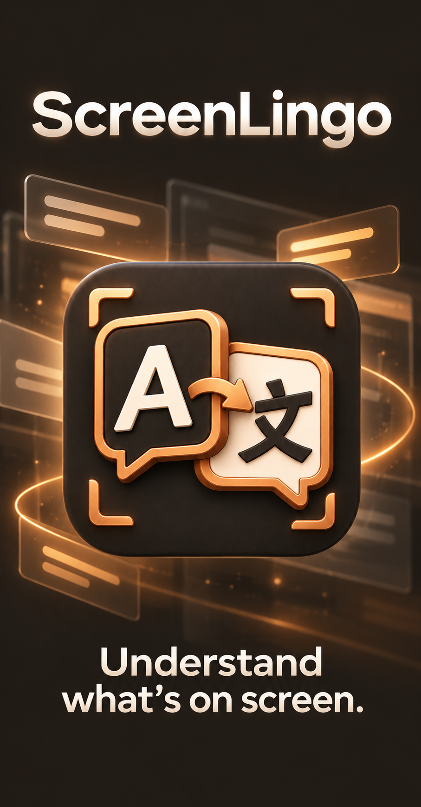

<p align="center">
  
</p>

<h1 align="center">ScreenLingo</h1>
<p align="center"><strong>Understand what's on screen.</strong><br />A compact Windows translator for game menus and everyday applications.</p>
<p align="center">
  <a href="https://github.com/itourboy-OG/ScreenLingo/releases/latest"><strong>Download for Windows</strong></a> ·
  <a href="https://github.com/itourboy-OG/ScreenLingo/releases">Release notes</a> ·
  <a href="https://github.com/itourboy-OG/ScreenLingo/issues">Report an issue</a>
</p>

Read a game's settings, navigate an unfamiliar menu, or translate another application without reaching for your phone. Choose your output language, switch to the window you want to read, and toggle the translation overlay with **Ctrl+Alt+T**.

Live mode checks that a region contains actual text and stays still before translating it. Moving chat and scrolling tickers are skipped; open a stationary chat panel or freeze a menu in Screenshot mode to read it. Settings and About stay inside the main ScreenLingo window.

For a menu that is difficult to read live, select **Screenshot translation** on the main panel or in Settings. **Ctrl+Alt+T** captures the current game once and opens a frozen image with a readable translation list. Use **Ctrl+mouse wheel** to zoom around your pointer, and **Ctrl+left-drag** to move the zoomed image. The zoom selector also offers **Fit image**, **100%**, **150%** and **200%**; wheel zoom spans 10%–800%. Turn off the image labels to inspect the original. The **Capture in 3 seconds** button gives you time to switch to the game. Close the reading window with Esc; Ctrl+Alt+Esc closes it and cancels any work in progress.

**Early Windows preview.** Actual games and exclusive fullscreen still need live testing. See [compatibility and current limits](#compatibility-and-current-limits) before choosing a display mode.

## A look inside

<table>
  <tr><th>Language controls</th><th>Settings</th></tr>
  <tr>
    <td align="center"></td>
    <td align="center"></td>
  </tr>
</table>

<p align="center"></p>

<details>
<summary><strong>Three skins: Copper, Paper and Plum</strong></summary>

Choose a look in **Settings → Appearance**. The controls and translation labels follow your saved skin.

<table>
  <tr><th>Copper</th><th>Paper</th><th>Plum</th></tr>
  <tr>
    <td align="center"></td>
    <td align="center"></td>
    <td align="center"></td>
  </tr>
</table>

</details>

## Get started

<details>
<summary><strong>A branded Windows installer</strong></summary>

<p align="center"></p>

</details>

**Requires Windows 10 version 2004 or newer, or Windows 11, x64.** Setup includes .NET, the recognition models, and the Microsoft Visual C++ x64 runtime needed for text recognition. The runtime may show a Windows permission prompt if it needs to be installed or updated.

1. Open the [latest release](https://github.com/itourboy-OG/ScreenLingo/releases/latest) and download the file named **`ScreenLingo-<version>-Setup-x64.exe`**. This is the complete installer; no ZIP extraction or separate supporting-file downloads are needed.
2. Run **ScreenLingo Setup**, choose your installation folder and optional desktop shortcut, then launch the app from the completion page or Start menu. Setup supports English and Spanish. Windows **Installed apps** provides the uninstaller.
3. Set **From** to automatic detection or the language you know is on screen. Choose your language under **Translate to**.
4. Enable translation, switch to your game or application, and open a menu. Start with a windowed or borderless display mode.
5. Press **Ctrl+Alt+T** to pause or resume whenever you need it.

For a first test, try an English game's settings menu with **English → Spanish**. If automatic detection misreads a short or mixed-language menu, choose the source language manually.

| Shortcut | Action |
| --- | --- |
| **Ctrl+Alt+T** | Toggle live translation, or capture once in Screenshot mode |
| **Ctrl+Alt+H** | Open the control window |
| **Ctrl+Alt+Esc** | Pause translation |

Assign Ctrl+Alt+T to a **Stream Deck** hotkey button. Minimize the control window to keep ScreenLingo in the system tray. Close the window or use the tray's Quit command to exit.

## What you can control

| Feature | Available in the preview |
| --- | --- |
| Languages | Automatic or manual source selection; English, Spanish, Simplified Chinese, French, German, Italian, Japanese, Korean, Portuguese and Russian |
| Capture | The active window, the window under your pointer, or the monitor under your pointer |
| Reading modes | Live overlay, or a frozen screenshot with zoom and a readable translation list |
| Translation | Online with MyMemory, or locally with a separately installed Ollama model |
| Appearance | Copper, Paper and Plum skins; text size and background opacity |
| Accessibility | Keyboard navigation, reduced motion, Windows high contrast and an overlay that lets clicks pass through |

Text already in your output language skips the translation request. Live mode continues watching for changes; screenshot mode retains the captured image until you close it or capture again. Unchanged frames skip recognition, and previously translated labels are cached for the session. Live labels remain visible while the next scan is processed. A refresh interval sets the scan schedule; recognition and translation can take longer than that interval.

## Translation services and privacy

**Online · MyMemory.** No API key is needed. Recognized text is sent to MyMemory; screenshots remain on your PC. Anonymous usage is limited to **5,000 characters per day** by the provider. Translation accuracy, response time and preservation of menu lines depend on the service. An exhausted quota or malformed response stops translation with a specific error. ScreenLingo does not silently switch services. See [usage limits](https://mymemory.translated.net/doc/usagelimits.php) and [terms](https://mymemory.translated.net/doc/en/tos.php).

**Offline · Ollama.** Requires a separate runtime and a downloaded multilingual model. ScreenLingo sends recognized text to **`127.0.0.1:11434`**. After installing the runtime and model, translation can work without internet. Offline setup and performance still need live validation.

<details>
<summary><strong>Set up local translation</strong></summary>

Install [Ollama for Windows](https://ollama.com/download/windows), then download the model used by the initial setting:

```powershell
ollama pull qwen3:4b
```

The [qwen3:4b model](https://ollama.com/library/qwen3:4b) download is approximately 2.5 GB. Select **Offline · Ollama** in Settings and enter the exact installed model name. Keep Ollama running while you translate.

</details>

Preferences and retry warnings are stored under **`%LOCALAPPDATA%\ScreenLingo`**. Diagnostic logs contain service hosts and retry codes, not screenshots or recognized text. ScreenLingo's control window and overlay are excluded from its capture.

## Updates

ScreenLingo checks GitHub Releases **on startup and every six hours** while running. You can also use **Settings → Check for updates**.

When a newer version is available, the main screen shows an update banner. Download its **Setup EXE** with progress, then choose **Install now** to close ScreenLingo and open the branded installer, or **Install later** to keep the download across restarts. Setup starts with your current application folder selected. Finish the wizard to install, and leave **Launch ScreenLingo** checked to reopen the app. Your preferences are preserved.

The updater verifies the EXE's size and GitHub SHA-256 digest before saving it and again before starting Setup. Deferred installers stay under **`%LOCALAPPDATA%\ScreenLingo\Updates`**. Setup handles application files and Windows uninstall registration; preferences stay separately under your local application data. Update checks do not send screenshots or recognized text to GitHub.

**Upgrading from 0.2.0:** run the new Setup EXE for the installed experience. Releases also retain a ZIP labeled **0.2.0 updater compatibility** so the old ZIP-only automatic updater can move to the current code. That bridge keeps the existing folder and does not register a Windows installation; run Setup afterward if you want installation and uninstall management. New installations and version 0.3.0 onward use the Setup EXE.

The preview installer is not code-signed. Windows may show an unknown-publisher warning; the name and icon do not replace a publisher certificate.

## Compatibility and current limits

- **Game compatibility is still being tested.** On a 3440×1440 Chinese Call of Duty Mobile PC lobby capture, the scene-text detector reduced 73 recognition candidates to 17 and removed the spurious labels across the scenery. On a settings capture, recognition retained 52 regions, including all 18 On/Off labels in nine toggle rows. These counts measure recognition candidates, not translation accuracy or complete coverage. Icons and very small text can still be misread. GTA and other games still require live tests.
- **Exclusive fullscreen is unverified.** A separate desktop overlay may not appear over an exclusive fullscreen game. Protected content or game restrictions can block capture. ScreenLingo does not inject into games or bypass those restrictions.
- **Recognition and translation can be imperfect.** Short labels, mixed languages and game-specific terms can be ambiguous. ScreenLingo translates visible text; it does not change the game's own language setting.
- **Offline translation is unverified.** The connector is included, but its setup, speed and accuracy still need a real local-model test.

Real integration checks cover window capture, English/Chinese recognition, language detection, online translation, overlay exclusion, skin persistence, update downloads and installation. Synthetic menus were used for translation checks. Each release's notes describe the checks completed for that version.

## Help shape the next update

The next focus is testing real game menus in **English → Spanish** and **Chinese → English/Spanish**, checking speed and display-mode behavior, and validating local translation. These are testing priorities, not promised release dates or confirmed compatibility claims.

[Report a problem](https://github.com/itourboy-OG/ScreenLingo/issues) with the game or application name, source and output languages, windowed/borderless/fullscreen mode, and what happened. Released additions, changes and fixes are listed in the [release notes](https://github.com/itourboy-OG/ScreenLingo/releases).

<details>
<summary><strong>Build and check from source</strong></summary>

Use the **.NET 9 SDK on Windows**. The source includes the recognition models and locked dependency versions.

```powershell
dotnet restore ScreenLingo.csproj --locked-mode --configfile NuGet.Config
dotnet build ScreenLingo.csproj --no-restore
dotnet run --project ScreenLingo.csproj --no-build -- --smoke-test C:\path\to\test-output
dotnet run --project ScreenLingo.csproj --no-build -- --recognition-check C:\path\to\menu.png zh-CN C:\path\to\recognition-output
dotnet run --project ScreenLingo.csproj --no-build -- --game-check <game-process-id> C:\path\to\game-test-output
dotnet run --project ScreenLingo.csproj --no-build -- --install-check C:\path\to\install-test-output C:\path\to\ScreenLingo-0.4.1-Setup-x64.exe C:\path\to\previous-0.2.0-package
dotnet run --project ScreenLingo.csproj --no-build -- --update-check C:\path\to\update-test-output
.\Publish.ps1 -PackageDirectory C:\path\to\package
pwsh -STA -File .\Build-Installer.ps1 -PackageDirectory C:\path\to\package -InstallerOutputDirectory C:\path\to\releases
```

The smoke check creates synthetic menu windows, captures those windows, calls the real online service with synthetic menu text, and writes screenshots plus `smoke-report.json`. It never sends your desktop contents to a translation service.

The recognition check measures an explicitly supplied image locally. The game check captures only the window belonging to the process ID you provide, saves its image and results in the report directory, and uses the configured test service (online MyMemory) to translate that window's recognized text. It does not depend on keeping the game focused.

`Publish.ps1` builds the self-contained Windows package, runs the appearance check and refreshes `Desktop\ScreenLingo\ScreenLingo.exe` after the check passes. Close the Desktop copy first. The appearance check uses the actual preferences form, verifies theme persistence and renders each skin without network requests. Results are saved in `screen-lingo-appearance-check` beside the package directory.

`Build-Installer.ps1` requires PowerShell 7 and pins the official Inno Setup 7.1.0 compiler and Microsoft runtime download by SHA-256 and Authenticode publisher. Build tools stay in the project's ignored `.tools` folder. It creates the branded installer and refreshes **`Desktop\ScreenLingo\ScreenLingo Setup.exe`**. The lifecycle check requires a new isolated report folder and no existing Windows-registered ScreenLingo installation; it installs, upgrades the actual previous app, and uninstalls its disposable copy.

</details>

Third-party licenses are included in `Licenses` and summarized in [THIRD-PARTY-NOTICES.md](THIRD-PARTY-NOTICES.md).
