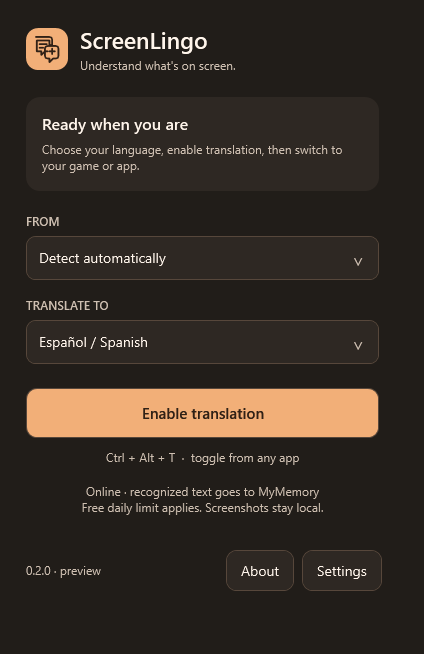

# ScreenLingo

A compact Windows screen translator for game menus and other applications. ScreenLingo is the permanent application name. This is an early Windows preview.

[Download the latest Windows build](https://github.com/itourboy-OG/ScreenLingo/releases/latest) · [Source repository](https://github.com/itourboy-OG/ScreenLingo)



## Use the preview

Open `ScreenLingo.exe` in the `ScreenLingo` folder on your Desktop, or from the extracted Windows package. Keep the supporting files beside the EXE. Select a source language (or automatic detection), choose the output language, enable translation, then switch to the game or application you want to read.

| Shortcut | Action |
| --- | --- |
| Ctrl+Alt+T | Enable or pause translation |
| Ctrl+Alt+H | Open the control window |
| Ctrl+Alt+Esc | Pause translation |

Assign Ctrl+Alt+T to a Stream Deck hotkey button. Minimize the control window to keep ScreenLingo in the system tray. Close the window or use the tray's Quit command to exit.

Settings → Appearance offers Copper (warm charcoal), Paper (light cream) and Plum (dark violet). Save changes to apply a skin to the controls and translation labels. The choice survives relaunching, and Windows high contrast takes precedence. Existing version 0.1 preferences are preserved and start with Copper.

Settings also offer active-window capture, the window under the pointer, or the entire monitor under the pointer. They control refresh frequency, text size, background opacity and reduced motion. A refresh interval is a scan schedule; recognition and translation can take longer. Unchanged frames skip recognition, and previously translated labels are cached for the session.

The included recognition languages are English, Spanish, Simplified Chinese, French, German, Italian, Japanese, Korean, Portuguese and Russian. Automatic detection uses the recognized screen text; short or mixed-language menus can be ambiguous. Select a source language explicitly if the result is incorrect. Text already in the chosen output language skips the translation request while the app continues watching for changes.

## Translation services and privacy

**Online: MyMemory.** No API key is needed. Recognized text is sent to the documented MyMemory API; screenshots remain on the PC. Anonymous usage is limited by the provider to 5,000 characters per day. New labels are batched to give the service surrounding menu context. This is a demonstration service: translation accuracy, response time and newline preservation depend on the provider. A malformed result or exhausted quota stops translation with an error; it does not silently switch services. Review the [MyMemory usage limits](https://mymemory.translated.net/doc/usagelimits.php) and [terms](https://mymemory.translated.net/doc/en/tos.php).

**Offline: Ollama.** Install [Ollama for Windows](https://ollama.com/download/windows), download a multilingual local model, and select Offline in Settings. For the initial model setting, run:

```powershell
ollama pull qwen3:4b
```

That model is approximately 2.5 GB. Use the exact installed model name in Settings. ScreenLingo connects only to `127.0.0.1:11434`, sends text rather than screenshots, and requests structured translation output. After downloading the runtime and model, translation can work without internet. Offline setup and performance have not been validated on this PC yet.

Preferences and retry warnings are stored under `%LOCALAPPDATA%\ScreenLingo`; this existing storage path is retained for compatibility. Diagnostic logs contain service hosts and retry codes, not screenshots or recognized text. ScreenLingo's own control window and translation overlay are excluded from its capture.

## Compatibility and current limits

- Windows 10 version 2004 or newer, or Windows 11, x64. The distributable includes .NET. Native OCR requires the [Microsoft Visual C++ x64 runtime](https://aka.ms/vs/17/release/vc_redist.x64.exe) if it is missing.
- Real window capture, Chinese/English recognition, automatic language detection, online translation, overlay exclusion and a borderless test window are covered by the smoke check.
- Call of Duty Mobile and other actual games still require live tests. An overlay drawn by a separate desktop app may not appear over an exclusive full-screen game. Protected content or game restrictions may block capture. This preview does not inject into games or bypass capture restrictions.
- Translation is plain screen text; it does not change the game's language setting or provide a verified game-specific terminology glossary.
- Actual games and offline translation still need live testing; the preview's integration checks use synthetic menus.

## Updates

ScreenLingo checks its GitHub Releases feed on startup and every six hours while running. Settings also has a **Check for updates** button. When a newer Windows package is available, the main screen shows a download banner with progress. After verification, choose **Install now** to close, update and reopen the app, or **Install later** to retain the download across restarts. Preferences are kept separately and preserved.

The updater verifies the package size and GitHub SHA-256 digest, rejects unsafe ZIP paths, and verifies staged files before installation. It stores downloads and the previous overwritten files under `%LOCALAPPDATA%\ScreenLingo\Updates`. Installation errors are shown explicitly; previous files are restored if copying fails. Screenshots and recognized text are never sent to GitHub.

## Build and check

Use the .NET 9 SDK on Windows. The bundled models and locked dependencies are included in the source folder.

```powershell
dotnet restore ScreenLingo.csproj --locked-mode --configfile NuGet.Config
dotnet build ScreenLingo.csproj --no-restore
dotnet run --project ScreenLingo.csproj --no-build -- --smoke-test C:\path\to\test-output
dotnet run --project ScreenLingo.csproj --no-build -- --install-check C:\path\to\install-test-output C:\path\to\package.zip
dotnet run --project ScreenLingo.csproj --no-build -- --update-check C:\path\to\update-test-output
.\Publish.ps1 -PackageDirectory C:\path\to\package
```

The smoke check briefly creates synthetic menu windows, captures those windows, calls the real online service with synthetic menu text, and writes screenshots plus `smoke-report.json`. It never sends the user's desktop contents to a translation service.

`Publish.ps1` builds the self-contained Windows package, runs the appearance check and refreshes `Desktop\ScreenLingo\ScreenLingo.exe` after the check passes. Close the Desktop copy before running it. The appearance check uses the actual preferences form, verifies theme persistence and renders each skin without network requests. Its results are saved in `screen-lingo-appearance-check` beside the package directory. Future delivered versions use the same name and Desktop folder.

Third-party licenses are included in `Licenses` and summarized in `THIRD-PARTY-NOTICES.md`.
